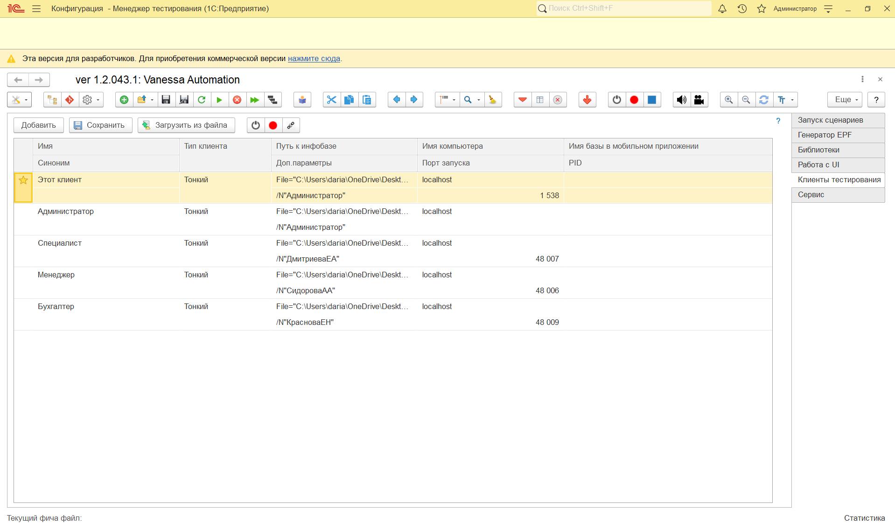

# Инструкция по проведению автоматизированного сценарного тестирования с помощью Vanessa Automation
## Подготовка
1. Необходимо скачать Vanessa Automation по [этому адресу](https://pr-mex.github.io/vanessa-automation/dev/).
2. Распакуйте и сохраните каталог с обработкой в удобное для вас место.
3. Создайте пустую информационную базу, которая будет использоваться в качестве "менеджера тестирования" для ваших тестируемых конфигураций. 
4. У созданной пустой информационной базы пропишите "Дополнительные параметры запуска:" /TESTMANAGER /N Администратор /P "", где:
- /TESTMANAGER - ключ запуска информационной базы в качестве менеджера тестирования;
- /N "" - имя пользователя запускаемой конфигурации;
- /P - пароль пользователя указанного в ключе /N;
5. Запускаем  информационную базу и открываем обработку "vanessa-automation.epf" (Сервис и настройки - Файл - Открыть...).
6. Ожидаем появление интерфейса обработки тестирования Vanessa Automaition 
7. На вкладке "Клиенты тестирования" справа добавляем новые клиенты. Пример предствален ниже. 
 
 В Доп.параметрах указывается имя пользователя, по которым будет проходить тестирование. 
 Для текущего проекта понадобится запуск по пользователями:
ДмитриеваЕА - специалист;
СидороваАА - менеджер;
КрасноваЕН - бухгалтер.
Для запуска выберите нужный клиент и нажмите [Запуск клиента тестирования](img/startclient.png).
8. Для запуска экспортных шагов необходимо добавить тесты в Библиотеку шагов:
- Сохраните все пять фича-файлы в любое удобное для вас место
- Перейдите на вкладку "Библиотеки" на панели справа
- Нажмите "Добавить" и укажите путь на папку с сохраненными фича-файлами
## Запуск сценариев тестирования
1. Для проведения тестировния понадобяться 5 файлов:
- СозданиеОбслуживанияКлиента.feature - запускается под пользователем с правами "Менеджер" и создает два документа "Обслуживание клиентов";
- ВыборСозданиеКонтрагента.feature - экспортный шаг, выберет контрагента или создаст нового, в случае необходимости;
- ВыборСозданиеДоговора.feature - экспортный шаг, выберет договор или создаст новый, в случае необходимости;
- ЗаполнениеИПроведениеОбслуживанияКлиента.feature - запускается под пользователем с правами "Специалист" и заполняет табличную часть у документа "Обслуживание клиентов", ранее созданных менеджером;
- МассовоеСозданиеАктовИФормированиеОтчета.feature - запускается под пользователем с правами "Бухгалтер ИТ фирмы" и запускает обработку "Массовое создание актов", которая  создаст документы "Реализация товаров и услуг" на оновании документов "Обслуживание клиентов", затем сформирует отчет "Анализ выставленных актов" и сравник их с шаблоном;
3. Откройте в запущеной обработке Vanessa Automation вкладку "Запуск сценариев", нажмите в 
верхней панели на пиктограмму  и откройте feature-файл.
4. Запустите сценарий на выполнение нажав в верхней панели инструментов на пиктограмму [Запуск теста](img/RunFeature.png).
5. Если тестирование пройдет успешно, все строчки сценария будут подсвечены зеленым цветом и внизу экрана будет выведено сообщение об успешном завершении сценария: "Выполнение сценариев закончено. Ошибок не было".
